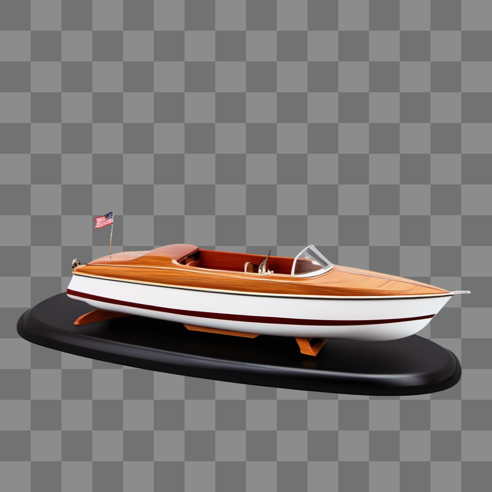
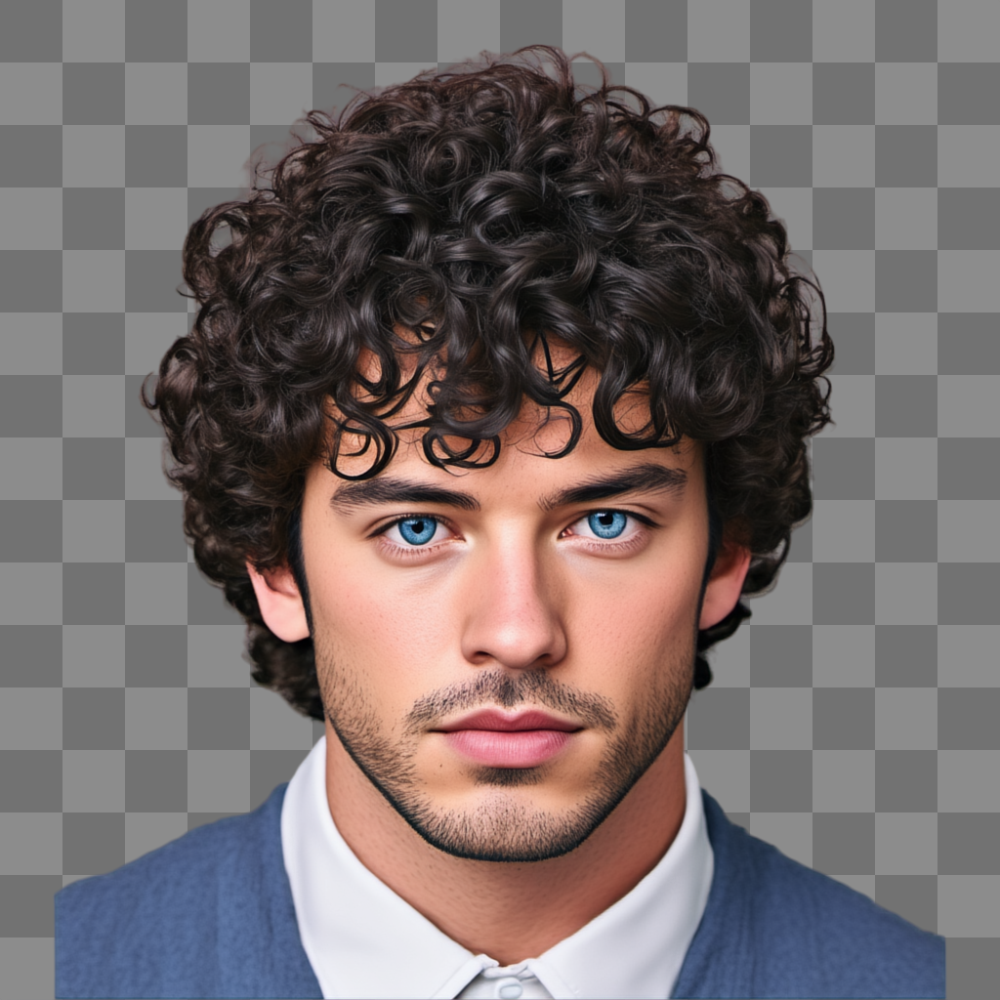

# LayerDiffuse-Flux
This repo is a Flux version implementation of LayerDiffuse ([LayerDiffuse](https://github.com/lllyasviel/LayerDiffuse)).

We train a **new transparent vae** to adapt to Flux and train a **lora** to finetune Flux to generate transparent images.

||||||||
|:-:|:-:|:-:|:-:|:-:|:-:|:-:|
## Installation

+ Clone this repository.
```shell
git clone https://github.com/RedAIGC/Flux-version-LayerDiffuse.git
cd Flux-version-LayerDiffuse
conda create -n flux_layer python=3.10 -y
conda activate flux_layer
pip install torch==2.3.0 torchvision==0.18.0 --index-url https://download.pytorch.org/whl/cu121
pip install -r requirements.txt
```
+ download weights
``` shell
huggingface-cli download --resume-download --local-dir ./models RedAIGC/Flux-version-LayerDiffuse 
```
+ Make sure that you have the following directory structure.
```
Flux-version-LayerDiffuse/
| - imgs
| - lib_layerdiffuse
| - models
    | - layerlora.safetensors
    | - TransparentVAE.pth
| ...
```

## Flux Transparent T2I
### demo
```shell
python demo_t2i.py --ckpt_path /your/path/to/FLUX.1_dev --prompt /your/prompt
```
### examples

| Examples: top to bottom: flux, flux-layer(ours), sdxl, sdxl-layer([LayerDiffuse](https://github.com/lllyasviel/LayerDiffuse))        |
|------------------------------------|
||
||
||
||
||


## Flux Transparent I2I
```shell
python demo_i2i.py --ckpt_path /your/path/to/FLUX.1_dev --image "./imgs/causal_cut.png" --prompt /your/prompt
```
Prompt: "a handsome man with curly hair, high quality"

Strength: 0.9

| Input (Transparent image)          | Output (Transparent image)                 |
|------------------------------------|--------------------------------------------|
|         |  | 

## Acknowledgements
Thanks lllyasviel for their great work [LayerDiffuse](https://github.com/lllyasviel/LayerDiffuse)

## Contact
If you have any questions about the code, please do not hesitate to contact us!

Email: sunshuang1@xiaohongshu.com, xiangqiang1601@163.com
